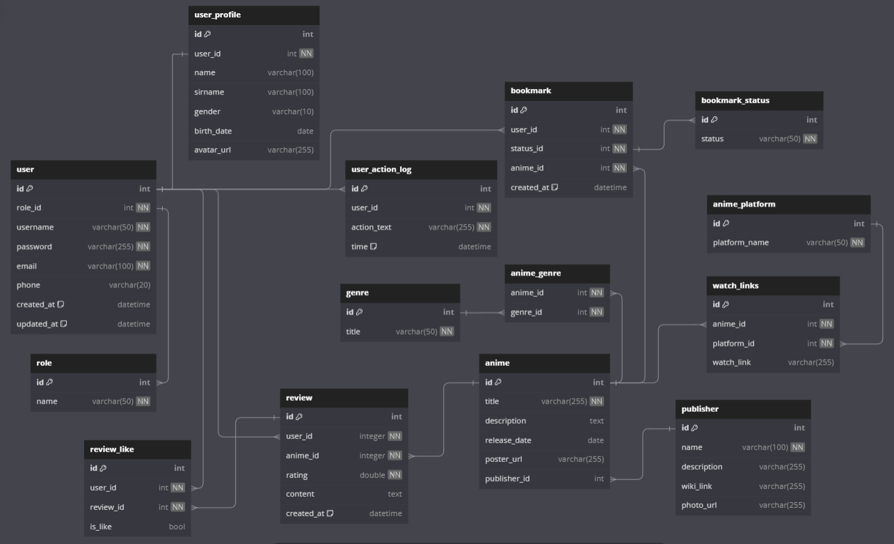

# Data models and database management systems

> Снежко Максим Андреевич
> 
> группа 253505

## Программный инструмент

AniMondo - это веб-портал для поклонников аниме, где пользователи могут находить, обсуждать и оценивать аниме-сериалы и фильмы. Платформа также предлагает возможность оставления отзывов и оценивании других отзывов о просмотренных произведениях.

## Функциональные требования

В приложении представлено 2 роли: пользователь и администратор.

### Возможности пользователя:
* Регистрация и авторизация пользователей (создание аккаунта, вход на сайт)
* Каталог аниме с возможностью просмотра информации, сортировки и поиска по различным критериям (жанры, год выхода, рейтинг и т.д.)
* Новости или блоги о новинках и событиях из мира аниме
* Оценка и рецензии пользователей (пользователи могут оценивать аниме и оставлять отзывы)
* Создание списков: Пользователи могут создавать свои собственные списки "Хочу посмотреть", "Смотрю", "Посмотрел"
* Просмотр информации об аниме (описание, жанры, студия и т.д.)
* Возможность редактирования своего профиля.
* Система рекомендаций на основе предпочтений пользователя

### Возможности администратора:
* Вход на сайт при помощи учетных данных
* Управление всеми сущностями
* Управление профилем пользователя

## Описание сущностей
  1. **Users (пользователи)**
     - **_id_**: INT, PK, AUTO_INCREMENT. Уникальный идентификатор пользователя. Автоматически увеличивается при добавлении нового пользователя.
     - **_role_id_**: INT, FK (roles), NOT NULL. Внешний ключ на таблицу ролей. Определяет роль пользователя.
     - **_username_**: VARCHAR(50), NOT NULL, UNIQUE. Уникальное имя пользователя. Не может быть пустым.
     - **_password_**: VARCHAR(255), NOT NULL. Не может быть пустым.
     - **_email_**: VARCHAR(100), NOT NULL, UNIQUE. Уникальная электронная почта пользователя.
     - **_phone_**: VARCHAR(20), UNIQUE. Номер телефона пользователя.
     - **_created_at_**: DATETIME(default: 'now()'). Время создания пользователя.  
     - **_updated_at_**: DATETIME(default: 'now()'). Время последнего обновления записи пользователя.
       
  2. **Roles (роли пользователей)**
     - **_id_**: INT, PK, AUTO_INCREMENT. Уникальный идентификатор роли. Автоматически увеличивается при добавлении новой роли.
     - **_name_**: VARCHAR(50), NOT NULL, UNIQUE. Уникальное название роли пользователя.
       
  3. **User Profiles (профили пользователей)**
     - **_id_**: INT, PK, AUTO_INCREMENT. Уникальный идентификатор профиля.
     - **_user_id_**: INT, FK (users), UNIQUE. Внешний ключ на таблицу пользователей.
     - **_name_**: VARCHAR(100). Имя пользователя.
     - **_sirname_**: VARCHAR(100). Фамилия пользователя.
     - **_gender_**: VARCHAR(10). Пол пользователя.
     - **_birth_date_**: DATE. Дата рождения пользователя.
     - **_avatar_url_**: VARCHAR(255). URL-адрес аватара пользователя.
       
  4. **User Action Log (лог действий пользователей)**
     - **_id_**: INT, PK, AUTO_INCREMENT. Уникальный идентификатор лога.
     - **_user_id_**: INT, FK (users), NOT NULL. Внешний ключ на таблицу пользователей. Лог относится к одному пользователю.
     - **_action_text_**: VARCHAR(255), NOT NULL. Описание действия пользователя.
     - **_time_**: DATETIME(default: 'now()'). Время действия.
       
  5. **Anime (аниме)**
     - **_id_**: INT, PK, AUTO_INCREMENT. Уникальный идентификатор аниме.
     - **_title_**: VARCHAR(255), NOT NULL. Название аниме.
     - **_description_**: TEXT. Описание аниме.
     - **_release_date_**: DATE. Дата выхода аниме.
     - **_poster_url_**: VARCHAR(255). URL постера аниме.
     - **_publisher_id_**: INT, FK (publishers). Внешний ключ на издателя аниме.

     Неявные связи:
     - многие-ко-многим с сущностью **genres** через сущность **anime_genres**.
       
  6. **Genres (жанры)**
     - **_id_**: INT, PK, AUTO_INCREMENT. Уникальный идентификатор жанра.
     - **_title_**: VARCHAR(50), NOT NULL, UNIQUE. Название жанра аниме.
 
     Неявные связи:
     - многие-ко-многим с сущностью **anime** через сущность **anime_genres**.
    
  7. **Publishers (издатели)**
     - **_id_**: INT, PK, AUTO_INCREMENT. Уникальный идентификатор издателя.
     - **_name_**: VARCHAR(100), NOT NULL. Название издателя.
     - **_description_**: VARCHAR(255). Описание издателя.
     - **_wiki_link_**: VARCHAR(255). Ссылка на страницу в Википедии.
     - **_photo_url_**: VARCHAR(255). URL-адрес логотипа или фотографии издателя.
       
  8. **Watch Links (ссылки для просмотра)**
     - **_id_**: INT, PK, AUTO_INCREMENT. Уникальный идентификатор ссылки.
     - **_anime_id_**: INT, FK (anime), NOT NULL. Внешний ключ на аниме.
     - **_platform_id_**: INT, NOT NULL. Название платформы для просмотра.
     - **_watch_link_**: VARCHAR(255). Ссылка на просмотр аниме.
       
  9. Reviews (отзывы)
     - **_id_**: INT, PK, AUTO_INCREMENT. Уникальный идентификатор отзыва.
     - **_user_id_**: INT, FK (users) NOT NULL. Внешний ключ на пользователя, оставившего отзыв.
     - **_anime_id_**: INT, FK (anime) NOT NULL. Внешний ключ на аниме, на которое написан отзыв.
     - **_rating_**: DOUBLE, NOT NULL. Оценка аниме.
     - **_content_**: TEXT. Содержание отзыва.
     - **_created_at_**: DATETIME(default: 'now()'). Время создания отзыва.
      
  10. **Bookmarks (закладки)**
      - **_id_**: INT, PK, AUTO_INCREMENT. Уникальный идентификатор закладки.
      - **_user_id_**: INT, FK (users) NOT NULL. Внешний ключ на пользователя.
      - **_status_id_**: INT, FK (bookmark_status) NOT NULL. Внешний ключ на статус закладки.
      - **_anime_id_**: INT, FK (anime) NOT NULL. Внешний ключ на аниме.
      - **_created_at_**: DATETIME(default: 'now()'). Время создания закладки.
      
  11. **Bookmark Status (статус закладки)**
      - **_id_**: INT, PK, AUTO_INCREMENT. Уникальный идентификатор статуса.
      - **_status_**: VARCHAR(50), NOT NULL. Название статуса (например, «Смотрю», «Просмотрено», «Хочу посмотреть»).
        
  12. **Review Likes (лайки к отзывам)**
      - **_id_**: INT, PK, AUTO_INCREMENT. Уникальный идентификатор лайка.
      - **_user_id_**: INT, FK (users) NOT NULL. Внешний ключ на пользователя, поставившего лайк.
      - **_review_id_**: INT, FK (reviews) NOT NULL. Внешний ключ на отзыв.
      - **_is_like_**: BOOL, NOT NULL. Лайк (true) или дизлайк (false).

  13. **Anime_platform (название платформы)**
      - **_id_**: INT, PK, AUTO_INCREMENT. Уникальный идентификатор названия платформы.
      - **_platform_name_**: VARCHAR(50), NOT NULL, UNIQUE.
        
## Описание связей
  * **Roles → Users**: Один ко многим. Один пользователь может иметь одну роль, но одна роль может быть у многих пользователей.

  * **Users → User_Profiles**: Один-к-одному. У одного пользователя может быть один профиль.

  * **Users → User_Action_Logs**: Один ко многим. Один пользователь может иметь несколько логов действий.

  * **Anime → Anime-Genre**: Один ко многим. Одно аниме может принадлежать нескольким жанрам.

  * **Anime-Genre → Genres**: Один ко многим. Один жанр может быть связан с несколькими аниме.

  * **Anime → Watch Links**: Один ко многим. Одно аниме может иметь несколько ссылок для просмотра.

  * **Publishers → Anime**: Один ко многим. Один издатель может быть связан с несколькими аниме.

  * **Users → Reviews**: Один ко многим. Один пользователь может оставить несколько отзывов.

  * **Reviews → Anime**: Один ко многим. Один отзыв относится к одному аниме.

  * **Users → Bookmarks**: Один ко многим. Один пользователь может добавить несколько аниме в закладки.

  * **Bookmarks → Anime**: Один ко многим. Одно аниме может находиться в закладках у нескольких пользователей.

  * **Users → Review_Like**: Один ко многим. Один пользователь может поставить лайк нескольким отзывам.

  * **Review Likes → Reviews**: Один ко многим. Один отзыв может получить несколько оценок от разных пользователей.

  * **Watch_links → Anime_Platform**: Многие к одному. Много ссылок могут ссылаться на одну аниме платформу.

## Диаграмма


[Таблицы с сайта dbdiagram.io](https://dbdiagram.io/)

```
Table user {
  id int [primary key, increment]
  role_id int [not null]
  username varchar(50) [not null, unique]
  password varchar(255) [not null]
  email varchar(100) [not null]
  phone varchar(20) [unique]
  created_at datetime [default: 'now()']
  updated_at datetime [default: 'now()']
}
Table role {
  id int [primary key, increment]
  name varchar(50) [not null, unique]
}
Table user_profile {
  id int [primary key, increment]
  user_id int [not null, unique]
  name varchar(100)
  sirname varchar(100)
  gender varchar(10)
  birth_date date
  avatar_url varchar(255)
}
Table user_action_log {
  id int [primary key, increment]
  user_id int [not null]
  action_text varchar(255) [not null]
  time datetime [default: 'now()']
}
Table anime { 
  id int [primary key, increment]
  title varchar(255) [not null]
  description text
  release_date date
  poster_url varchar(255)
  publisher_id int
}
Table genre {
  id int [primary key,increment]
  title varchar(50) [not null, unique]
}
Table anime_genre {
  anime_id int [not null]
  genre_id int [not null]
}
Table publisher {
  id int [primary key, increment]
  name varchar(100) [not null]
  description varchar(255)
  wiki_link varchar(255)
  photo_url varchar(255)
}
Table watch_links {
  id int [primary key, increment]
  anime_id int [not null]
  platform_id int [not null]
  watch_link varchar(255)
}
Table anime_platform {
  id int [primary key, increment]
  platform_name varchar(50) [not null, unique]
}
Table review {
  id int [primary key, increment]
  user_id integer [not null]
  anime_id integer [not null]
  rating double  [not null]
  content text
  created_at datetime [default: 'now()']
}
Table bookmark {
  id int [primary key, increment]
  user_id int [not null]
  status_id int [not null]
  anime_id int [not null]
  created_at datetime [default: 'now()']
}
Table bookmark_status {
  id int [primary key, increment]
  status varchar(50) [not null]
}
Table review_like {
  id int [primary key, increment]
  user_id int [not null]
  review_id int [not null]
  is_like bool
}

Ref: user.role_id  < role.id
Ref: user.id - user_profile.user_id
Ref: user.id < user_action_log.id
Ref: anime.id < anime_genre.anime_id
Ref: anime_genre.genre_id > genre.id
Ref: anime.publisher_id > publisher.id
Ref: anime.id < watch_links.anime_id
Ref: review.user_id > user.id
Ref: review.anime_id > anime.id
Ref: bookmark.user_id > user.id
Ref: bookmark.anime_id > anime.id
Ref: bookmark.status_id < bookmark_status.id
Ref: user.id < review_like.user_id
Ref: review_like.review_id > review.id
Ref: watch_links.platform_id > anime_platform.id
```
